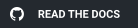
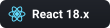
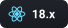
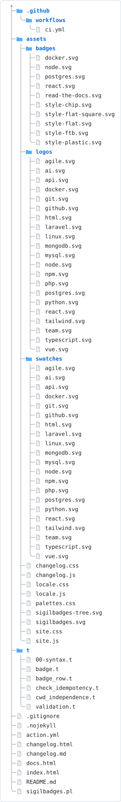
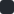
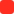
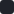
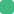

<p align="center"></p>

<p align="center">
<!--[[ badge: id=read-the-docs logo=github message="Read the Docs" color=24292F style=for-the-badge link="https://lucianofedericopereira.github.io/sigilbadges/" ]]-->
<a href="https://lucianofedericopereira.github.io/sigilbadges/"></a>
<!--/-->
</p>

# sigilbadges

Generated SVG badges (logo + text) inserted into `README.md` via marker
comments, in the same spirit as `sigilmd`: no template language, no CPAN
dependencies, one Perl script. Badge generation needs no external binary at
all — SVG is just text, so this is pure core Perl end to end.

## Showcase

<!--[[ badge: id=style-chip logo=react label="React" message="18.x" ]]-->

<!--/-->
<!--[[ badge: id=style-flat label="build" message="passing" color=1f883d style=flat ]]-->

<!--/-->
<!--[[ badge: id=style-flat-square label="coverage" message="92%" color=44CC11 style=flat-square ]]-->

<!--/-->
<!--[[ badge: id=style-plastic label="version" message="v2.0.4" color=007EC6 style=plastic ]]-->

<!--/-->
<!--[[ badge: id=style-ftb logo=docker label="docker" message="ready" style=for-the-badge ]]-->

<!--/-->

A row, sharing one set of defaults:

<!--[[ badge-row: style=chip
logo=react message="18.x"
logo=node message="20.x"
logo=postgres message="16"
logo=docker message="ready"
]]-->
<p align="center">



</p>
<!--/-->

## Usage

```sh
perl sigilbadges.pl [--file README.md] [--badges-dir assets/badges] [--check]
```

- `--file` — the Markdown file to scan and rewrite (default `README.md`)
- `--badges-dir` — where generated `.svg` files are written (default `assets/badges`)
- `--check` — exit non-zero if the file or any badge is out of date, without writing anything (CI-friendly)

## Project structure

Kept current by [treegen2](https://github.com/lucianofedericopereira/treegen2) — `color="github"` matches this project's own graphite branding rather than treegen2's own green site accent (its `color=` parameter itself defaults to `github`, same as here).

<!-- filetree:start dir="." exclude=".git,t/fixtures" style="svg" color="github" svg-output="assets/sigilbadges-tree.svg" title="sigilbadges project structure" -->

<!-- filetree:end -->

## Grammar

A single badge:

```
<!-- [[ badge: logo=php label="PHP" message="8.5" ]] -->...<!--/-->
```

A responsive row of badges, one spec per line, all inside the tag itself:

```
<!-- [[ badge-row: style=chip
logo=php label="PHP" message="8.5"
logo=node message="20.x"
]] -->...<!--/-->
```

(The extra space after `<!--` and before `-->` above keeps these
illustrative snippets from being picked up as real markers — the scanner
matches `<!-- [[...]] -->` (no inner spaces, in reality) anywhere in the
file, including inside fenced code blocks, since it has no notion of
Markdown fences. Real markers have no space after `<!--` or before `-->`.)

The `badge-row: key=value ...` header is optional and sets defaults every
line inherits/overrides. Per-badge specs live in the marker's own tag rather
than the body — same idiom as `badge:` — so the row survives being re-run:
the body between the markers is pure rendered output, fully regenerated
every time.

## Keys

| key           | meaning                                             | default                                   |
| ------------- | ---------------------------------------------------- | ------------------------------------------ |
| `logo`        | name of an SVG in `assets/logos/` (no extension)      | —                                          |
| `label`       | left-hand text                                        | —                                          |
| `message`     | right-hand text                                       | —                                          |
| `color`       | bare hex, no `#` (e.g. `color=336791`)                | logo's brand color, else `555555`          |
| `label-color` | bare hex for the label segment                        | `555555`                                   |
| `logo-color`  | bare hex to recolor the logo                          | `FFFFFF`                                   |
| `style`       | `chip`, `flat`, `flat-square`, `plastic`, `for-the-badge` | `chip`                                 |
| `id`          | explicit filename stem (`assets/badges/<id>.svg`)     | derived from `logo` / `label` / `message`  |
| `link`        | wraps the badge `` in an `<a href="...">`        | —                                          |
| `alt`         | `alt` text on the ``                             | `label` + `message`, else `logo`           |

Colors are always a bare 6-digit hex value — no CSS color names (`blue`,
`green`, ...) and no leading `#`.

## Styles

- **`chip`** (default) — rounded chip with a top-to-bottom color gradient,
  logo first, single color segment. This project's own look.
- **`flat`** — two-tone rectangle (label segment + message segment),
  rounded corners. Matches the classic shields.io badge look.
- **`flat-square`** — same two-tone layout as `flat`, sharp corners.
- **`plastic`** — same two-tone layout, with a glossy highlight band.
- **`for-the-badge`** — bigger, bold, uppercase label/message text.

`flat`, `flat-square`, and `plastic` only render as two colored segments
when *both* `label` and `message` are given (shields.io's own convention);
with just one of the two, it collapses to a single segment in `color`.

## Logos

Available under `assets/logos/<name>.svg`, each with a default brand color:

| logo         | brand color |
| ------------ | ----------- |
| `agile`      |  `0052CC`    |
| `ai`         |  `EC4899`    |
| `api`        |  `6366F1`    |
| `docker`     |  `2496ED`    |
| `git`        |  `F05032`    |
| `github`     |  `24292F`    |
| `html`       |  `E34F26`    |
| `laravel`    |  `FF2D20`    |
| `linux`      |  `3A3A3A`    |
| `mongodb`    |  `47A248`    |
| `mysql`      |  `4479A1`    |
| `node`       |  `5FA04E`    |
| `npm`        |  `CB3837`    |
| `php`        |  `777BB4`    |
| `postgres`   |  `336791`    |
| `python`     |  `3776AB`    |
| `react`      |  `20232A`    |
| `tailwind`   |  `06B6D4`    |
| `team`       |  `7C3AED`    |
| `typescript` |  `3178C6`    |
| `vue`        |  `42B883`    |

A badge with `logo=` and no `color=` uses this table automatically.
